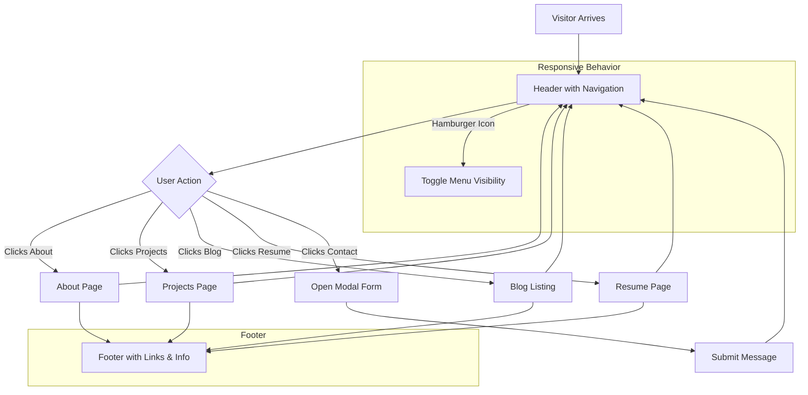

# Optimize Navigation and User Interface

## Overview

This guide helps you tailor the navigation structure and user interface of your Astro-based portfolio site to create an intuitive and engaging browsing experience. You will learn how to customize navigation links, arrange header and footer elements, and highlight your most important content pages, so visitors can effortlessly discover your professional profile, projects, blog posts, and contact options.

### Prerequisites

- A working Astro portfolio site installed and running locally.
- Basic familiarity with editing Astro components and layouts.
- Access to the `src/components/Header.astro`, `src/components/Footer.astro`, and `src/layouts/Page.astro` files.

### Expected Outcome

- Customized navigation bar with links reflecting your key pages.
- Responsive header and footer structure supporting easy navigation.
- A user-friendly layout that promotes your most critical site sections.

### Time Estimate

Approximately 20–30 minutes for initial customization.

### Difficulty Level

Beginner to Intermediate

---

## 1. Understanding Your Current Navigation and Layout

Your site uses three main components to provide consistent navigation and interface across pages:

- **Header:** Contains the navigation menu, including links to About, Projects, Blog, Resume, and Contact.
- **Footer:** Displays supplemental links and copyright information.
- **Page Layout (`Page.astro`):** Wraps each page with the `Header` and `Footer`, plus metadata handling.

This modular setup ensures consistency and simplifies updates site-wide.

---

## 2. Customizing Navigation Links in the Header

### Locate Navigation Links

Navigation links are defined inside `src/components/Header.astro`. Here, links appear as clickable elements that route to your main pages.

### Step-by-Step Modifications

<Steps>
<Step title="Open the Header Component">
Open the file `src/components/Header.astro` in your code editor. This component holds the code controlling navigation elements.
</Step>
<Step title="Identify Navigation Items">
Look for the `<nav>` element or list (`<ul>`/`<li>`) containing links to pages like About (`/`), Projects (`/projects`), Blog (`/blog`), and Resume (`/resume`).
</Step>
<Step title="Add or Remove Links">
- To add a new link, insert a new `<a>` tag with an appropriate `href` to your page.
- To remove an unwanted link, delete its corresponding HTML element.
</Step>
<Step title="Rearrange Links for Priority">
Drag and drop the list items in the desired order to prioritize which pages you want visitors to find first.
</Step>
<Step title="Save and Test Locally">
Run your local dev server if not running (`npm run dev` or equivalent) and refresh your browser to verify the navigation bar reflects your changes.
</Step>
</Steps>

### Example: Adding a "Contact" Link

```astro
<nav><ul>
  <li><a href="/">About</a></li>
  <li><a href="/projects">Projects</a></li>
  <li><a href="/blog">Blog</a></li>
  <li><a href="/resume">Resume</a></li>
  <li><a href="#" id="contact-link">Contact</a></li> <!-- Opens modal -->
</ul></nav>
```

This link may trigger a modal popup defined in the Header component JavaScript.

---

## 3. Structuring the Header and Footer for Seamless Navigation

### Header

- **Responsive Design:** The header includes a hamburger menu icon for small screens, enabling toggling the navigation menu.
- **Active Link Highlighting:** Active page links are styled differently to help users know their current location.
- **Modal Contact Form:** The "Contact" link typically activates a modal that allows visitors to send messages without leaving the page.

### Footer

The footer component (`src/components/Footer.astro`) usually includes:

- Copyright statements with the current year and site owner.
- Supplemental navigation or legal links such as Privacy Policy.
- Social media or external profiles if configured.

### Adjusting Header/Footer Content

Modify the respective `.astro` files to update text, add or remove links, or change layout containers.

---

## 4. Surfacing Important Pages and Calls to Action

### Prioritize Links Near Logo or at Start

Visitors expect the most important links to be easily accessible. Place About, Projects, and Blog links at the beginning of the navigation menu.

### Use Clear Link Labels

Keep link text concise and descriptive. For example, use "Projects" not "My Amazing Projects".

### Leverage Visual Hierarchy

Enhance important links with CSS classes or tags (e.g., highlighted buttons). Ensure contrast and font sizes promote scanability.

### Consider Adding Featured Sections

On the homepage or landing page, feature direct links or buttons to your highest-value content such as recent blog posts or flagship projects.

---

## 5. Example: Sample Navigation Bar HTML Snippet

```html
<nav class="navbar">
  <ul class="navbar-menu">
    <li class="navbar-item"><a href="/">About</a></li>
    <li class="navbar-item"><a href="/projects">Projects</a></li>
    <li class="navbar-item"><a href="/blog">Blog</a></li>
    <li class="navbar-item"><a href="/resume">Resume</a></li>
    <li class="navbar-item"><a href="#" id="contact-link">Contact</a></li>
  </ul>
</nav>
```

---

## 6. Verify Navigation Behavior Across Devices

### Desktop

- Navigation links should display inline with clear spacing.
- Hover and focus styles should be visually clear.

### Mobile

- Hamburger icon should toggle the menu visibility.
- Links should be large enough for touch targets.
- Modal contact form should open/close smoothly.

Run manual testing on various screen sizes or use browser developer tools to emulate device widths.

---

## 7. Tips and Best Practices

- **Consistent Styling:** Use your global CSS variables to ensure navigation colors and fonts match your site's branding.
- **Accessible Markup:** Use semantic HTML elements like `<nav>`, proper ARIA roles where needed, and ensure keyboard navigability.
- **Limit Link Quantity:** Avoid overcrowding the navigation bar; prioritize key pages only.
- **Intuitive Placement:** Place contact options toward the right or at the end for natural scanning.
- **Test After Updates:** Always verify that navigation updates do not break routes or UI responsiveness.

---

## 8. Troubleshooting Common Issues

<AccordionGroup title="Common Navigation Issues">
<Accordion title="Navigation Links Not Updating">
Ensure you have saved all files and restarted the local dev server if necessary. Check for typos in URLs or `href` attributes.
</Accordion>
<Accordion title="Hamburger Menu Not Toggling on Mobile">
Verify that the client-side JavaScript (`src/js/index.js`) responsible for toggle behavior is correctly loaded and not throwing errors in the browser console.
</Accordion>
<Accordion title="Contact Modal Does Not Open">
Check that the contact link has the correct ID or event binding inside the Header component. Ensure the modal markup and script exist.
</Accordion>
<Accordion title="Active Link Highlighting Fails">
Confirm that the logic handling the current page URL is implemented correctly to apply active CSS class.
</Accordion>
</AccordionGroup>

---

## 9. Next Steps & Related Content

- **Customize Site Styles:** Learn how to further personalize navigation appearance by updating global styles in the [Customize Site Styles and Branding guide](/guides/customization-best-practices/customize-site-styles).
- **Enhance Navigation with UI Components:** Explore dynamic navigation elements and interaction patterns in the [UI Components documentation](/usage/site-navigation/ui-components).
- **Add and Manage Content Pages:** Follow [Showcase Your Projects and Resume](/guides/content-management/showcase-projects-and-resume) to add new content that navigation links can point to.
- **Deploy Your Site:** Once satisfied, see the [Deploy Your Portfolio Site guide](/guides/getting-started/deploy-your-portfolio) to publish your updated navigation live.

---

## Summary

This page has equipped you with practical, stepwise instructions to tailor your portfolio site's navigation and interface. By focusing on link management, header/footer structuring, and prioritization of key pages, you ensure visitors experience a smooth journey through your professional story.


---

## Additional Resources

- [Site Configuration Basics](/getting-started/setup-installation/configuration-setup-basics)
- [Architecture Overview](/overview/architecture-integration/architecture-overview)
- [Creating & Publishing Blog Posts](/guides/content-management/create-blog-post)
- [UI Components](/usage/site-navigation/ui-components)


---

## Visual Reference



This illustrates the navigation flow and how user actions map to page changes within the site.
