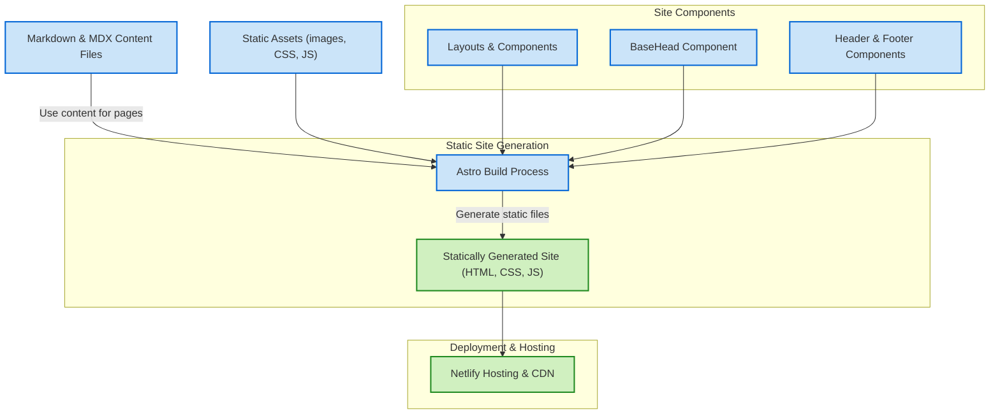

# System Architecture (with Mermaid Diagram)

## Overview

This page provides a clear, high-level overview of the portfolio website's system architecture. It walks you through the flow starting from static content and heading through Astro layouts and components, culminating in static site generation and deployment—primarily using platforms such as Netlify.

By understanding this architecture, you will gain insight into how the site delivers performant, SEO-friendly pages with modular components and dynamic content integration.

---

## Architecture Purpose & Positioning

The system architecture is designed to:

- Deliver lightning-fast, statically generated pages using Astro.
- Combine flexibility in content creation with structured layouts for consistency.
- Support dynamic content insertion via components and content collections.
- Enable seamless deployment pipelines with minimal configuration.

This design empowers developers and content creators to focus on building and managing content without sacrificing performance or maintainability.

---

## Core Workflow: From Content to Deployment

The architecture orchestrates several key parts working together:

1. **Content Source - Markdown & MDX Files**
   - The site’s core content—including blog posts, projects, and privacy policies—is stored as Markdown and MDX files within organized content collections.

2. **Astro Components and Layouts**
   - Static pages are composed using Astro components such as layout wrappers (`Page.astro`), head metadata (`BaseHead.astro`), and UI elements like headers and footers.

3. **Static Site Generation (SSG)**
   - During the build, Astro pre-renders pages by combining content with components, generating highly optimized static HTML, CSS, and JS assets.

4. **Dynamic Enhancements & SEO**
   - Meta tags and canonical URLs are injected globally through `BaseHead`.
   - Dynamic sitemap and robots.txt files are generated to improve discoverability.

5. **Deployment to Hosting Platforms**
   - The pre-built static assets are deployed primarily to Netlify, taking advantage of its continuous deployment and global CDN for fast delivery.

---

## Detailed Components and Their Roles

| Component          | Role & Benefit                                      |
|--------------------|----------------------------------------------------|
| **Markdown/MDX**   | Content source files providing structured, rich content easily editable by users. |
| **Astro Layouts**  | Wrappers that ensure consistent page structure and styling (e.g., `Page.astro`). |
| **BaseHead.astro** | Injects essential SEO metadata, favicons, styles, and global scripts on every page. |
| **Header/Footer**  | Navigation and footer areas deliver user-friendly browsing and branding consistency. |
| **Static Generation** | Combines content and components to pre-render optimized HTML assets for performance. |
| **Deployment Platform (Netlify)** | Hosts the generated static assets with CDN and provides automatic build pipelines. |

---

## Architecture Flow Diagram

---

## Practical Scenario: How a Page Is Rendered

Imagine you want to create a new blog post:

1. You write your article in an MDX file inside the blog content folder.
2. At build time, Astro reads this MDX file, combines it with layout and UI components — such as the header, footer, and `BaseHead` for SEO metadata.
3. Astro pre-renders the blog page into a static HTML file.
4. The static file, CSS, and JS assets are uploaded to Netlify.
5. When visitors access your blog page URL, they receive a fast-loading, fully rendered page delivered from the CDN.

This process ensures that every page is fast, SEO-friendly, and consistent in appearance.

---

## Best Practices & Tips

- **Organize content in collections:** Keep blog posts, projects, and policy pages separated in well-defined folders for easy maintenance.
- **Leverage `BaseHead` for SEO:** Always pass descriptive titles and descriptions to the `BaseHead` component to maximize search engine visibility.
- **Reuse layouts/components:** Define common UI elements once and reuse them across pages to maintain effortlessness and consistency.
- **Validate deployment pipelines:** Use Netlify's logs and preview to verify that static assets build and deploy correctly.
- **Customize sitemap/robots.txt rules:** Tailor these for search engines to index desired site areas effectively.

---

## Troubleshooting

<AccordionGroup title="Common Issues & How to Fix Them">
<Accordion title="Page Metadata Not Showing Correctly">
Check that the `BaseHead` component receives the correct `title` and `description` props in your page or layout files. Incorrect or missing props will result in generic or missing SEO tags.
</Accordion>
<Accordion title="Build Fails or Missing Static Files">
Ensure all referenced images, CSS, and scripts exist in the `static` or appropriate asset folders. Missing files referenced from MDX or components cause build errors.
</Accordion>
<Accordion title="Deployment Issues on Netlify">
Verify that the build command is correctly set to Astro’s build script and that the publish directory points to Astro’s output folder (usually `dist`). Check Netlify logs for errors.
</Accordion>
</AccordionGroup>

---

## Next Steps

For deeper understanding and continued exploration, consider visiting these related documentation pages:

- [Architecture Overview](../intro/architecture) — for richer detail on site structure and integration.
- [UI Components](../../usage/site-navigation/ui-components) — to learn about interactive navigation and interface patterns.
- [Creating & Managing Blog Posts](../../guides/content-management/create-blog-post) — to start adding dynamic content.
- [Deploy Your Portfolio Site](../../guides/getting-started/deploy-your-portfolio) — to understand deployment workflows.

---

Understanding this architecture empowers you to customize, extend, and maintain your personal portfolio site with confidence and clarity.

