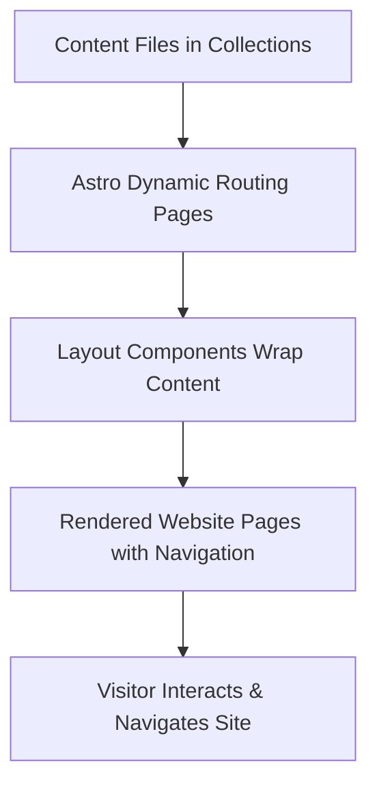

# Core Concepts & Terminology

Welcome to the foundational guide that demystifies the essential concepts driving this portfolio website powered by Astro. Here, you'll gain clarity on the key terms such as **layout components**, **content collections**, **dynamic routing**, and **Astro pages**—all explained in human-friendly language. This knowledge equips you to navigate both the documentation and the underlying codebase with confidence.

---

## Why Core Concepts Matter

Before diving into customization or content creation, understanding how your site’s content is structured and displayed is crucial. This page explains the architectural building blocks and terminology from a user perspective—focusing on _what you can do_ rather than how things are internally implemented.

Knowing these core concepts empowers you to:

- Effectively organize and add new content
- Customize the site layout to match your vision
- Troubleshoot navigation or rendering issues
- Understand documentation references with ease

---

## Key Concepts Explained

### Layout Components
A **layout component** is like a reusable frame or template that wraps around page content to ensure consistent design and structure.

- They define common elements such as headers, footers, and sidebars.
- They provide placeholders where your unique content is injected.
- For example, the `Page.astro` layout standardizes the site’s main container, bringing together the header navigation and footer.

_Why it matters_: Layout components save you from repeating code across multiple pages and keep your site visually cohesive.

### Content Collections
Content collections are organized groupings of markdown or MDX files categorized by type, such as blog posts or documentation pages.

- For instance, the `blog` collection holds individual blog posts.
- Astro provides APIs like `getCollection('blog')` to fetch and manage this grouped content.
- Each item in a collection carries metadata (title, date) and body content used to generate pages dynamically.

_Why it matters_: Content collections allow you to maintain and update similar types of pages easily without manual routing or individual page coding.

### Dynamic Routing
Dynamic routing lets the website generate pages automatically based on content instead of creating fixed routes for each.

- For example, the blog post pages are generated from the slugs in the `blog` content collection.
- Using a filename pattern like `[...slug].astro` means URLs correspond to content folder structure.
- If a blog post with slug `my-first-post` exists, it automatically maps to `/blog/my-first-post/`.

_Why it matters_: This dynamic approach saves you time and reduces mistakes by automating page creation from your content.

### Astro Pages
Astro pages are the core building blocks representing individual website routes.

- They are `.astro` files inside the `src/pages` directory.
- Each page corresponds to a URL path on your website.
- Pages often import layout components and provide content or structure within them.

For example, `src/pages/index.astro` is the homepage, while `src/pages/blog/[...slug].astro` handles dynamic blog entries.

_Why it matters_: Understanding pages lets you know where to place or modify content and how your URL structure is formed.

---

## How These Concepts Work Together

Picture creating a blog post:

1. **Content Collection:** You write a markdown file inside the `blog` collection folder with frontmatter that includes a title, date, and description.
2. **Dynamic Routing & Pages:** The dynamic `[...slug].astro` page picks up this file's slug and generates a URL route.
3. **Layout Component:** The blog post gets wrapped in the `BlogPost.astro` layout, which organizes how the post appears—title, date, and body content.
4. **Site Navigation UI:** Navigation components reflect the new post automatically by reading the collection.

This seamless flow means you focus on content while the site framework handles display and navigation.

---

## Practical Examples & User Scenarios

### Example 1: Viewing Blog Posts
- The site fetches all blog entries using the content collection API.
- It sorts posts by publication date.
- Posts are displayed grouped by year on the `/blog` index page.
- Clicking on a post link takes you to the dynamically generated page using its slug.

This user flow provides an intuitive archive and detail view without manual URL mapping.

### Example 2: Adding New Pages
- Creating `src/pages/projects.astro` adds a new static page `/projects`.
- The page imports the main page layout and inserts project showcase content.
- No manual configuration of routes is needed.

This means adding site sections is straightforward and declarative.

### Example 3: Customizing Layouts
- Want your blog posts to show the publish date differently?
- Modify the `BlogPost.astro` layout component.
- Changes propagate to all blog posts because each post uses that layout.

You can consistently update styling or structure site-wide from one place.

---

## Best Practices & Tips

- **Keep content & layout separate:** Write your content in markdown files; style and structure with layouts.
- **Use metadata effectively:** Frontmatter fields like `title` and `pubDate` drive navigation and sorting.
- **Follow naming conventions:** Slug and filename conventions ensure smooth dynamic routing.
- **Leverage reusable UI components:** Use header, footer, and formatting components to keep design consistent.

## Common Pitfalls to Avoid

- **Mismatch between slug and file structure:** Make sure slug values correspond exactly to file paths to avoid broken links.
- **Ignoring layouts:** Don’t embed presentation logic inside content files; layouts control appearance.
- **Hardcoding URLs:** Prefer programmatic linking using slug and collection data to prevent stale references.

---

## Summary Diagram: Content Flow in the Site

---

## Next Steps

- Explore the [Architecture Overview](/overview/intro/architecture) to see how core concepts fit into the overall site.
- Learn about [UI Components](/usage/site-navigation/ui-components) to customize navigation and interactive elements.
- Follow the guide on [Creating & Managing Blog Posts](/guides/content-management/create-blog-post) to start adding your own content.

---

By understanding these core concepts and terminology, you unlock the full potential of your Astro-powered portfolio site. This foundational knowledge ensures smooth navigation through both your content and the underlying framework.